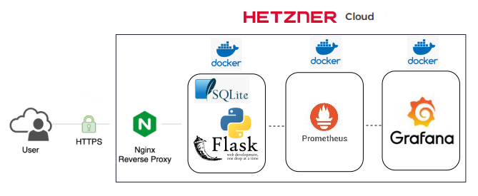

# MyWeb
This project involves setting up a web application where Nginx serves as 
a reverse proxy, directing incoming HTTPS requests to a Flask-based 
backend API running in a Docker container. The backend is powered by 
Python/Flask application, which serves dynamic content. A simple web page 
interface is also part of the project, enabling interaction with users. 
For data storage, the application uses SQLite, a lightweight and 
serverless relational database, for storing and retrieving data.




### Requirements:

## Versions:
- Python3: 3.10.12
- Nginx: nginx/1.18.0 (Ubuntu)
- Flask: 3.0.3
- Werkzeug 3.0.4
- Ubuntu: 22.04
- Docker: 27.3.1, build ce12230
- Docker-compose: 2.28.1
- Ansible: core 2.16.11
- jinja: 3.1.4

# Build image:
1. Clone the repo
```bash
git clone https://github.com/matusik-ops/MyWeb
```
2. Build it
```bash
cd ./MyWeb
docker build -f Docker/Dockerfile -t testimg . # docker build -f <path/to/Dockerfile> -t <image_name> . 
```

# How to run it

1. Git clone repo "MyWeb"
```bash
git clone https://github.com/matusik-ops/MyWeb
```

2. Install Ansible
```bash
sudo apt update
sudo apt install software-properties-common
sudo add-apt-repository --yes --update ppa:ansible/ansible
sudo apt install ansible
```

3. Rewrite all vars and inventory in automation/Ansible
```bash
cd MyWeb/Ansible
vim inventory 
vim ... # vars
```
4. Run playbook in automation/Ansible folder "start.yml"
```bash
ansible-playbook -i inventory start.yml
```
